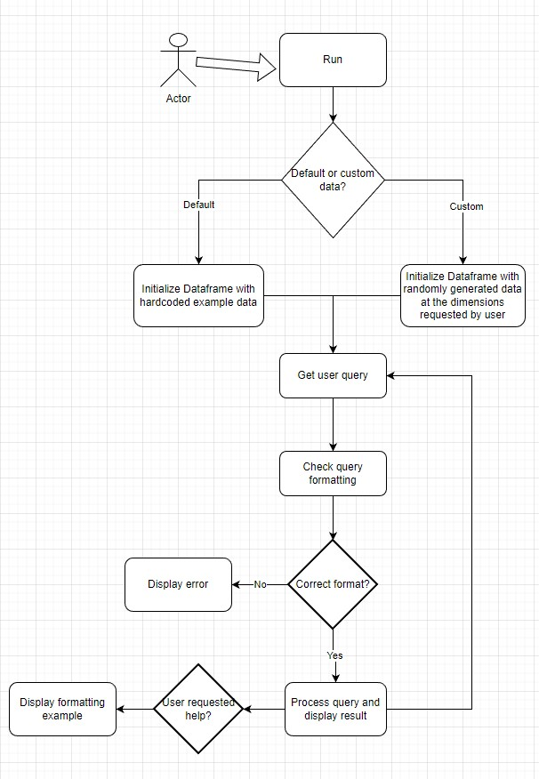

# User Audience
A short program that ingests queries and returns user counts of a defined audience

### User Guide
1. Ensure requirements are installed as indicated at bottom of the README
2. Execute `run.py` using the command in terminal `python run.py`
3. Follow prompts in the command line, using --help for help

### Design Discussion
**First**, there was the debate of how to store the data as described in the assignment.
With the potential of tens of millions of entries, the data storage needed to be efficient.
My first approach involved using a dict of sets, with the keys being the segment name, and the values being the 
sets containing the users that are associated with these sets. I liked this approach because it would allow the query operations to be extremely fast (time-complexity). 
However, I soon ran into memory usage problems. 

So, I had to resort to a more memory-efficient solution using pandas Dataframes. This allowed me to effectively 
have the same time-complexity I wanted, with a better solution for memory usage. In the solution, I constructed a pandas Dataframe in the same format as laid out in the example data given in the assignment. I also provided a custom generator, so the user could manipulate the dimensions as they please. For the sake of time, 
I will refer to only my pandas Dataframe approach for the remainder of the discussion.

**Secondly**, there was the process of deciding how to implement the three functions:
1. FunctionA(): Get the number of users who are in a given segment
   * For this function, I thought the implementation was pretty straightforward. Since the given segment is a column key in the Dataframe, I could simply return the sum of the column (the number of 1's). Time complexity is O(n)
2. FunctionB(): Get the Number of users who are in a given combination of segments
   * For this function, we really just want the bitwise operation (&, AND) between the given segments. Once we have the result of this operation, we could return the size of the result. Time complexity is O(n)
3. FunctionC(): Get the number of users who are in at least one segment in a given combination of segments
   * This function was very similar to FunctionB, but replace the bitwise operator & (AND) with | (OR)

Overall, there are some cons to this approach. Nothing is pre-computed, every single query is performed in real-time. This could be improved by using a cache of sorts to retrieve common query results faster.
Memory storage isn't the greatest either, since we need to store within an MxN matrix.

### Flowchart

### Requirements
* Python 3.10.5
* You can skip all steps below using `pip3 install -r requirements.txt`
* Refer to `requirements.txt` for required Python libraries
* 
